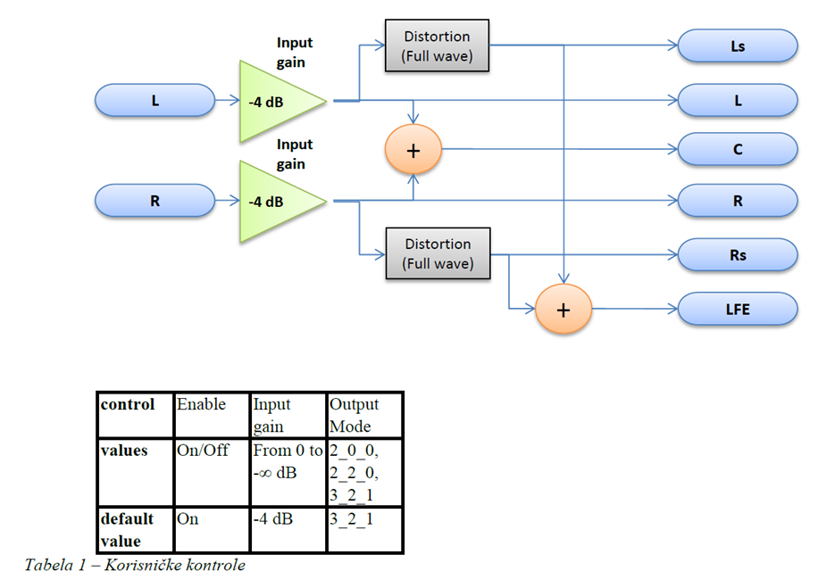

# DSP Channel Combining Project

This project is a solution for combining multiple signal channels based on a given schema, implemented for a Digital Signal Processor (DSP) platform. It is a part of the "Algorithms and Architectures of Digital Signal Processors" (AADSP) course.

## Project Overview

The goal of this project is to develop and optimize signal channel processing in C and adapt the solution for the DSP platform.

  
   
  <em>Scheme</em>

### Task Description:
1. Implement reference C code for channel combining using floating-point arithmetic.
2. Process data in blocks of 16 signal samples. The input consists of 2 channels, and the output consists of up to 8 channels.
3. Allow file names and control parameters to be passed via command-line arguments.
4. Adapt the reference C code to the Crystal DSP processor using the provided methodology across four models.
5. Automate testing and ensure that outputs meet the expected criteria.
6. Optimize the assembly in Model 3 and perform function profiling (estimate MIPS consumption) before and after optimization.
7. Integrate the solution into the Cirrus Logic OS environment.

## Implementation Phases

### Model 0
- **Description**: The initial reference model. The primary goal here is accuracy, not performance.
- **Testing**: Verified using Audacity.

### Model 1
- **Description**: Algorithmic improvements over Model 0. Direct memory access replaces array index access. Critical variables are made global, reducing function arguments.
- **Objective**: The output must be identical to Model 0.

### Model 2
- **Description**: Adaptation of Model 1 for the Cirrus Logic DSP platform, switching from floating-point to fixed-point arithmetic. Emulation classes for data types are introduced.
- **Output**: Slight output differences of 1-2 bits per sample compared to Model 1.

### Model 3
- **Description**: Final platform-specific model, introducing memory partitioning and assembly-level optimization for reduced resource consumption.
- **Optimizations**: Implemented using assembly for better MIPS performance.

## Testing and Verification

- **Comparison**: Each model is compared against the previous one to ensure no errors were introduced.
- **Automation**: Testing is automated using the `run_test.py` script, with output comparisons done via `PCMCompare.exe`.
- **Tools**: Visualization of output is performed using Audacity.
- **Profiling**: The profiling results for the processing function are:
  - 1800-1900 MIPS for C code without debug information.
  - 1100-1200 MIPS for the assembly code.
  - 710 MIPS for the optimized, parallelized assembly code.

## Requirements

- Cirrus Logic DSP development environment
- Python (for testing automation)
- Audacity (for output visualization)

## Running Tests

1. Compile the code for the desired model.
2. Use the `run_test.py` script to automate testing and generate output.
3. Compare the results using `PCMCompare.exe` or visualize them in Audacity.
